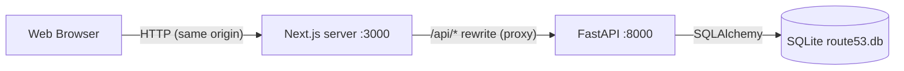

# Architecture Overview

## High-Level System Architecture



*   **Browser:** Runs the React/Next.js application. It only ever calls the Next.js origin, including for API requests (`/api/...`).
*   **Next.js server:** Server-renders pages (Cloudscape components SSR to HTML, so there is no flash of unstyled content) and proxies `/api/*` to FastAPI via `rewrites` in `next.config.ts`.
*   **FastAPI backend:** RESTful API for authentication, hosted zones and DNS records. Also has a CORS allowlist for direct cross-origin callers.
*   **SQLite DB:** A single file (`backend/route53.db`) holding all application state, with its schema managed by Alembic.

### Why proxy instead of calling FastAPI directly?
The session will be an **httpOnly cookie** (Phase 2). If the browser called `:8000` directly, that would be a cross-origin request: it would need `credentials: "include"`, a non-wildcard CORS origin, and, once frontend and backend are deployed on different domains, `SameSite=None; Secure` third-party cookies, which browsers increasingly block. Proxying makes every API call same-origin, so the cookie "just works" and no CORS preflight is needed.

## Request flow (example: health check)

1. `BackendStatus` (client component) runs `getHealth()` from `src/lib/api.ts` in a `useEffect`.
2. `fetch("/api/health")` → Next.js server matches the rewrite and forwards it to `${BACKEND_URL}/api/health`.
3. FastAPI resolves the `get_db` dependency (one SQLAlchemy session per request) and runs the sync `def` handler in its threadpool.
4. The handler executes `SELECT 1`; it returns `200` or `503` with `"database": "error"`.
5. `apiFetch` returns the JSON, or throws `ApiError(status, detail, body)` for non-2xx; the component maps that to a Cloudscape `StatusIndicator`.

## Frontend Structure (Next.js 16, App Router)

*   **Routing:** App Router (`src/app/`). Layouts will hold the console shell (top nav + side nav) from Phase 5.
*   **Styling / components:** AWS **Cloudscape Design System**, the open-source design system the real AWS console is built with. `@cloudscape-design/global-styles` is imported once in the root layout (normalize, Open Sans fonts, design tokens). Every Cloudscape component ships with `'use client'`, so server components can render them directly.
*   **Rendering config:** `cacheComponents` is **disabled** (see DECISIONS.md): Cloudscape calls `Date.now()` during render, which Cache Components rejects at build time.
*   **API client layer:** `src/lib/api.ts`. `apiFetch<T>()` prefixes `/api`, sends JSON, parses responses safely (including non-JSON proxy errors) and throws a typed `ApiError` carrying the backend's `{"detail": "..."}` message. Components never call `fetch` directly.
*   **State management:** local component state for UI. React Query will manage server state once data fetching starts (Phase 2/3).
*   **Component architecture (planned):**
    *   `Layouts`: global shell (top navigation, side navigation, breadcrumbs).
    *   `Pages`: composed views matching Route 53 routes.
    *   `Components`: Cloudscape-based feature components (e.g. hosted zones table, record forms).

## Backend Structure (FastAPI)

```
backend/
  main.py          app instance, CORS middleware, routers mounted under /api
  config.py        Settings (pydantic-settings): DATABASE_URL, CORS_ORIGINS, version
  database.py      build_engine(), engine, SessionLocal, Base, get_db()
  routers/         one module per resource (health.py; auth/zones/records to come)
  alembic/         env.py + versions/ (migration history)
  tests/           pytest, with an isolated temp SQLite DB per test
```

*   **Routers:** endpoints grouped by resource, mounted with an `/api` prefix in `main.py` so routers stay prefix-agnostic.
*   **Configuration:** a single typed `Settings` object, cached with `lru_cache`. `.env` is read from `backend/` regardless of the working directory.
*   **Database session:** `get_db()` yields one session per request and always closes it. Tests swap it via `app.dependency_overrides`.
*   **Sync handlers:** SQLAlchemy is used synchronously, so DB-touching endpoints are declared with `def` (not `async def`). FastAPI runs them in a threadpool, keeping the event loop free.
*   **Error shape:** every error response is `{"detail": "..."}` (FastAPI's default for `HTTPException`).
*   **Planned layers:** `models.py` (ORM), `schemas.py` (Pydantic request/response models), service/CRUD functions, and auth dependencies.

## Database & Migration Strategy

*   **Engine:** `database.build_engine()` creates the SQLAlchemy engine. For SQLite it sets `check_same_thread=False` (sessions are used from FastAPI's threadpool) and runs `PRAGMA foreign_keys=ON` on every new connection, since SQLite ignores `FOREIGN KEY`/`ON DELETE CASCADE` without it.
*   **Single source of truth:** the default `DATABASE_URL` is an absolute path to `backend/route53.db`, so the API and Alembic always use the same file whatever the current directory. `alembic.ini` deliberately contains no URL; `alembic/env.py` imports the app's `engine` and `Base.metadata`.
*   **Migrations:** every schema change is a revision in `alembic/versions/`. `uv run alembic upgrade head` creates or upgrades the DB. `render_as_batch=True` makes Alembic rebuild tables for column changes SQLite can't `ALTER`.
*   **Current state:** revision `0001` (baseline) is intentionally empty and only creates the database file. Feature tables arrive with their phases (users/sessions in Phase 2, hosted zones in Phase 3, records in Phase 4).

## Why This Stack?
*   **Next.js + TS:** industry standard for scalable React apps. TypeScript prevents runtime errors and acts as documentation.
*   **Cloudscape:** the AWS console's own design system, giving the closest possible Route 53 look and behaviour (tables, pagination, modals, flashbars).
*   **FastAPI:** fast to build with, built-in Pydantic validation, and auto-generated OpenAPI docs at `/docs`.
*   **SQLite:** zero configuration and file-based, so no PostgreSQL or Docker setup is needed to run the project.
