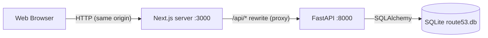

# Architecture Overview

## High-Level System Architecture



*   **Browser:** Runs the React/Next.js application. It only ever calls the Next.js origin, including for API requests (`/api/...`).
*   **Next.js server:** Server-renders pages (Cloudscape components SSR to HTML, so there is no flash of unstyled content) and proxies `/api/*` to FastAPI via `rewrites` in `next.config.ts`.
*   **FastAPI backend:** RESTful API for authentication, hosted zones and DNS records. Also has a CORS allowlist for direct cross-origin callers.
*   **SQLite DB:** A single file (`backend/route53.db`) holding all application state, with its schema managed by Alembic.

### Why proxy instead of calling FastAPI directly?
The session is an **httpOnly cookie**. If the browser called `:8000` directly, that would be a cross-origin request: it would need `credentials: "include"`, a non-wildcard CORS origin, and, once frontend and backend are deployed on different domains, `SameSite=None; Secure` third-party cookies, which browsers increasingly block. Proxying makes every API call same-origin, so the cookie "just works" and no CORS preflight is needed.

### Deployed
The same shape in production: Next.js on **Vercel**, FastAPI on **Render** (`render.yaml`). `BACKEND_URL` points the rewrite at the Render URL. The browser only sees the Vercel domain, so the cookie set by FastAPI (passed through the proxy) belongs to that domain, and `COOKIE_SECURE=true` works because the browser ↔ Vercel leg is HTTPS. The proxy matters even more here: `vercel.app` and `onrender.com` are both on the Public Suffix List, so a direct call would always be cross-site. Render's free filesystem is ephemeral, so the SQLite file is recreated (migrations + demo user) on each deploy, restart and spin-down; see README → Deployment.

## Request flow (example: health check)

1. A client (a monitor, or `curl http://localhost:3000/api/health`) requests `/api/health` from the Next.js origin.
2. The Next.js server matches the rewrite and forwards it to `${BACKEND_URL}/api/health`.
3. FastAPI resolves the `get_db` dependency (one SQLAlchemy session per request) and runs the sync `def` handler in its threadpool.
4. The handler executes `SELECT 1`; it returns `200` or `503` with `"database": "error"`.
5. In the frontend, every call goes through `apiFetch` (`src/lib/api.ts`), which returns the JSON or throws `ApiError(status, detail, body)` for non-2xx.

## Authentication

Mocked accounts (one seeded `admin` user), but real session mechanics: bcrypt password hashes, server-side sessions, and an httpOnly cookie.

### Sign in and session restore

```mermaid
sequenceDiagram
    participant B as Browser
    participant N as Next.js (proxy.ts + pages)
    participant A as FastAPI
    participant D as SQLite

    B->>N: GET / (no cookie)
    N-->>B: 307 → /login  (proxy.ts, before any page renders)
    B->>N: POST /api/auth/login {username, password}
    N->>A: (rewrite)
    A->>D: SELECT user · bcrypt.checkpw
    A->>D: DELETE expired sessions · INSERT session (sha256(token), expires_at = now + 12h)
    A-->>B: 200 {id, username} + Set-Cookie: session=<token>; HttpOnly; SameSite=Lax
    Note over B: useLogin caches the user → LoginForm redirects to ?next or /
    B->>N: GET / (cookie)  → proxy.ts lets it through
    B->>A: GET /api/auth/me (cookie)  via AuthGuard
    A->>D: SELECT session by sha256(cookie) · check expires_at
    A-->>B: 200 {id, username} → page renders
```

A page reload repeats the last three steps. That is the session restore.

### Route protection: two layers in front, one boundary behind

| Layer | Where | Checks | Catches |
|---|---|---|---|
| `src/proxy.ts` | Next.js server, before rendering | A `session` cookie **exists** | Logged-out visitors, redirected with no flash of protected UI. Adds `?next=<path+query>`. |
| `<AuthGuard>` | `(console)` layout, client | `GET /api/auth/me` returns 200 | Expired, forged or logged-out cookies; any later `401` |
| `get_current_user` | FastAPI dependency | Session row exists and `expires_at > now` | Everything. This is the real security boundary. |

`proxy.ts` deliberately does **not** send cookie holders away from `/login`. With an expired cookie that would loop (proxy → `/`, guard → `/login`, …). The login page asks `/me` instead and only redirects if the session is really valid.

### Frontend auth state
*   One React Query cache entry, `["me"]`, is the single source of truth: `undefined` = checking, `null` = signed out, `User` = signed in.
*   `/me` answering `401` is converted to `null` (an answer, not an error), so it never shows as a failure or gets retried.
*   A global `QueryCache`/`MutationCache` `onError` sets `["me"]` to `null` on **any** `401`, so a session that expires mid-use sends the user to `/login?next=<current page>`.
*   **Explicit sign out** is different on purpose. After the backend confirms, `useLogout` does a full-page `window.location.replace("/login")`, with no `?next=`, so the next person to sign in doesn't land on the previous user's page. The full reload also discards all of the old user's data held in memory.

## Frontend Structure (Next.js 16, App Router)

*   **Routing:** App Router (`src/app/`). `/login` is public. Every signed-in page lives in the `(console)` route group, whose layout wraps it in `<AuthGuard>` and the console shell. Route groups add no URL segment. `/` redirects to `/hosted-zones` until the Dashboard exists. `src/proxy.ts` is Next 16's replacement for `middleware.ts`.
    *   `/hosted-zones`: list · `/hosted-zones/create` · `/hosted-zones/[zoneId]`: details · `/hosted-zones/[zoneId]/edit`
    *   `(console)/[...slug]`: any other side-navigation link shows "Coming soon"; unknown paths are a 404.
*   **Styling / components:** AWS **Cloudscape Design System**, the open-source design system the real AWS console is built with. `@cloudscape-design/global-styles` is imported once in the root layout (normalize, Open Sans fonts, design tokens). Every Cloudscape component ships with `'use client'`, so server components can render them directly.
*   **Rendering config:** `cacheComponents` is **disabled** (see DECISIONS.md): Cloudscape calls `Date.now()` during render, which Cache Components rejects at build time.
*   **API client layer:** `src/lib/api.ts`. `apiFetch<T>()` prefixes `/api`, sends JSON, parses responses safely (including non-JSON proxy errors) and throws a typed `ApiError` carrying the backend's `{"detail": "..."}` message. Components never call `fetch` directly.
*   **State management:** TanStack React Query for server state (one `QueryClient` per tab, created in `src/app/providers.tsx`; 4xx errors are never retried). Local component state for UI. Auth hooks live in `src/lib/auth.ts`.
*   **Console shell:** `ConsoleShell` (Cloudscape `AppLayoutToolbar`) draws the top bar (`ConsoleTopNav`), the bottom bar (`ConsoleFooter`), side navigation (`lib/navigation.ts`), breadcrumbs, the stacked notifications and the split panel. Pages don't render these themselves. They declare what they need with `useConsolePage({ breadcrumbs, contentType, splitPanel })` (`lib/console-page.tsx`), and the shell renders it.
*   **Top and bottom bars:** `ConsoleTopNav` is Cloudscape `TopNavigation` in custom-content mode with the dark `top-navigation` visual context, laid out like the console's bar (sizes and colours measured from the reference screenshots). `ConsoleSearch` (a Cloudscape Input acting as an ARIA combobox, focused by Alt+S) opens the console's dark results panel under the bar: a category list, then result cards per section (side-navigation pages; the user's hosted zones, fetched on first use), "Show more" for a whole section, and the no-results message. Arrow keys move a highlight held in state (`aria-activedescendant`), so the focus stays in the box. `AccountMenu` is the console's dark account panel attached under the bar: a mock 12-digit account ID derived from the user id (`lib/account.ts`), the account name, the account links and Sign out. Controls with nothing behind them (CloudShell, Notifications, Services, footer links) open a `ComingSoonPopover`. `AppLayoutToolbar` gets `headerSelector` and `footerSelector`, so its sticky parts fit between the two bars.
*   **Help panel:** AppLayout's tools drawer shows Cloudscape `HelpPanel` content from `lib/helpTopics.tsx` (one entry per topic: header, body, "Learn more" links). `lib/help.tsx` holds whether it's open and the topic an `<InfoLink topic=…>` chose; otherwise the shell shows the page's `helpTopic` from `useConsolePage`. Navigating resets the topic to the new page's default and keeps the panel open or closed. Pages without a topic ("Coming soon") have no help panel. After an Info click, focus moves to the panel's close button (`focusToolsClose`).
*   **Notifications:** `lib/notifications.tsx` holds the Flashbar messages above the page, so a message survives navigation (e.g. "created" shown on the details page the create page sends you to). `notify` returns an id, so a page can later `replace` it (the blue "Creating…" message becomes the green or red result) or `dismiss` it. Every API error uses one format, `apiErrorNotification`: "Error occurred / Please try again later. / (<API detail>)", as in the console. For errors the console words specially, the API adds a `code` and the middle line changes (e.g. `RecordSetAlreadyExists` → "A record with the specified name already exists.").
*   **Zone data:** `lib/zones.ts` wraps `lib/api.ts` in React Query hooks. `["zones"]` is the list and `["zones", id]` one zone with its records. After a mutation the list is invalidated, and the details page reuses the zone returned by create or edit without fetching it again.
*   **Record data:** `lib/records.ts` holds the record mutations (create several, update, delete several). A record change refetches the zone's details (its records) and the zones list (its record count). `isProtectedRecord` is the console's rule for the SOA and apex NS records, which can't be deleted.
*   **Changes ("View status"):** record creates and edits return a `change_info`. `useNotifyChangeSubmitted` (`lib/changes.tsx`) shows the console's blue banner with a "View status" button, which opens the Change Info page (`/hosted-zones/[zoneId]/changes/[changeId]`). That page fetches `GET /api/changes/{id}`; its refresh button refetches, and the status turns from PENDING to INSYNC 30 seconds after submission. Pages can ask the shell for a narrower centred column with `useConsolePage({ maxContentWidth })`, as the console's Change Info page is.
*   **Components:** Cloudscape-based building blocks shared between pages: `ZoneDetailsFields` (details page and list split panel), `ZoneFormParts` + `VpcAssociations` (create and edit pages), `RecordsTable` + `RecordDetailsPanel` + `EditRecordForm` (a zone's records; the split panel showing the selected one, which its "Edit record" button turns into the edit form), `DeleteRecordsModal` (the "Delete N selected records?" dialog), `TablePreferences` (the Preferences dialog and search-mode sentence shared by both tables), `RecordFields` (one record's fields, shared by the Create record page and the edit panel; `ColumnLayout` gives two columns on the page and one in the narrow panel), with the dropdowns' texts and order in `lib/recordTypes.ts`, `DeleteZoneModal`, `ZoneLoadError`, `ZoneFeatureTabs`.
*   **Tables:** `@cloudscape-design/collection-hooks` (`useCollection`) does filtering, sorting, pagination and selection in the browser. Each row is precomputed as the text its columns show, so search and sort work on what the user sees.

## Backend Structure (FastAPI)

```
backend/
  main.py          app instance, CORS middleware, 400 validation handler, routers under /api
  config.py        Settings (pydantic-settings): DATABASE_URL, CORS_ORIGINS, session TTL/cookie
  database.py      build_engine(), engine, SessionLocal, Base (naming convention), get_db()
  models.py        ORM models: User, UserSession, HostedZone, HostedZoneVpc, DnsRecord (+ utcnow helper)
  schemas.py       Pydantic request/response models (auth, zones, VPCs, records)
  security.py      bcrypt hash/verify, session token generation + SHA-256 hashing
  dependencies.py  get_current_user (session check for protected endpoints)
  services/        business rules (zones.py: IDs, name servers, default records, CRUD rules)
  dns_names.py     domain name validation and normalization ("Example.COM" -> "example.com.")
  mock_vpcs.py     the mocked Regions and VPCs offered for private zones
  routers/         one module per resource (health.py, auth.py, zones.py, vpcs.py)
  alembic/         env.py + versions/ (migration history)
  tests/           pytest, with an isolated temp SQLite DB per test
```

*   **Routers:** endpoints grouped by resource, mounted with an `/api` prefix in `main.py` so routers stay prefix-agnostic.
*   **Configuration:** a single typed `Settings` object, cached with `lru_cache`. `.env` is read from `backend/` regardless of the working directory.
*   **Database session:** `get_db()` yields one session per request and always closes it. Tests swap it via `app.dependency_overrides`.
*   **Sync handlers:** SQLAlchemy is used synchronously, so DB-touching endpoints are declared with `def` (not `async def`). FastAPI runs them in a threadpool, keeping the event loop free.
*   **Error shape:** every error response is `{"detail": "..."}`. `HTTPException` produces it natively, and a global `RequestValidationError` handler turns FastAPI's default `422` (a list of error objects) into `400 {"detail": "<field>: <message>"}`.
*   **Auth dependency:** protected endpoints declare `Depends(get_current_user)` (or `APIRouter(dependencies=[...])` for a whole router). The cookie is read via FastAPI's `APIKeyCookie`, so `/docs` marks protected endpoints with a lock.
*   **Layers:** routers (HTTP only) → `services/` (the rules, raising `HTTPException` with the API's status codes) → `models.py` (ORM). `schemas.py` validates request bodies and shapes responses. Auth stayed in its router because it's a few lines.

## Database & Migration Strategy

*   **Engine:** `database.build_engine()` creates the SQLAlchemy engine. For SQLite it sets `check_same_thread=False` (sessions are used from FastAPI's threadpool) and runs `PRAGMA foreign_keys=ON` on every new connection, since SQLite ignores `FOREIGN KEY`/`ON DELETE CASCADE` without it.
*   **Single source of truth:** the default `DATABASE_URL` is an absolute path to `backend/route53.db`, so the API and Alembic always use the same file whatever the current directory. `alembic.ini` deliberately contains no URL; `alembic/env.py` imports the app's `engine` and `Base.metadata`.
*   **Migrations:** every schema change is a revision in `alembic/versions/`. `uv run alembic upgrade head` creates or upgrades the DB. `render_as_batch=True` makes Alembic rebuild tables for column changes SQLite can't `ALTER`.
*   **Current state:** revision `0003`. `0001` (baseline) is empty and only creates the database file. `0002` adds `users` and `sessions` and seeds the demo user. `0003` adds `hosted_zones`, `hosted_zone_vpcs` and `records`. Details: [DB_SCHEMA.md](DB_SCHEMA.md).

## Hosted zones: how a change flows

1.  **Create:** the create page checks only what the console checks before calling the API (empty name, description length, empty VPC rows). It shows a blue "Creating hosted zone …" message and `POST`s. The backend normalizes the name, checks VPCs against the mock catalog and uniqueness per user, generates the zone ID and four name servers, and inserts the zone with its NS and SOA records in one transaction. The page turns the message green and opens the new zone's details page, using the zone from the response.
2.  **Edit:** `PATCH` changes the description and, for a private zone, replaces its VPC list. You return to the page you came from (list or details) with "… was successfully updated."
3.  **Delete:** the dialog asks for `delete` to be typed. The backend refuses with `409` (Route 53's message) while the zone holds records other than its NS and SOA. Otherwise it deletes the zone, and `ON DELETE CASCADE` removes those two records and the VPC rows.
4.  **Errors:** every `400`/`404`/`409` from the API becomes the red "Error occurred" message with the API's text, as in the console.

## Why This Stack?
*   **Next.js + TS:** industry standard for scalable React apps. TypeScript prevents runtime errors and acts as documentation.
*   **Cloudscape:** the AWS console's own design system, giving the closest possible Route 53 look and behaviour (tables, pagination, modals, flashbars).
*   **FastAPI:** fast to build with, built-in Pydantic validation, and auto-generated OpenAPI docs at `/docs`.
*   **SQLite:** zero configuration and file-based, so no PostgreSQL or Docker setup is needed to run the project.
